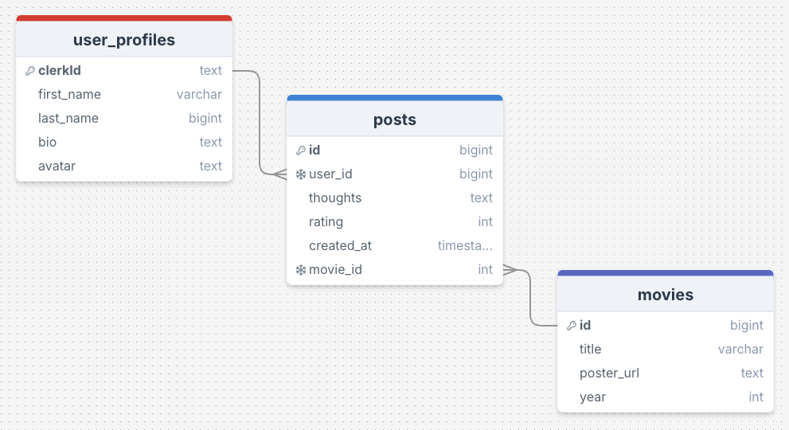

# Build a Social Network

Week 9 Assignment - Build a Social Network

ReelTerror is a social platform for horror movie fans to discover, review, and discuss their favorite scary films. Users create a profile (with avatar, bio, etc.), browse through posts about movies — including poster, title, year, and rating — and share their own thoughts. Each review is tied to a user and movie. ReelTerror aims to bring together horror lovers in a space where they can safely express their opinions, find kindred spirits, and explore the genre more deeply.

## Requirements
- 🎯 Set up user sign-up and user login using Clerk. ✅
- 🎯 Create and display an error/not found page if the user visits a page that doesn’t exist. ✅
- 🎯 Use 1 or more Radix UI Primitive component, or something similar (e.g. use of a different component library to enhance UX, not just Tailwind). ✅
    - Used tooltip for the custom avatar icon in the header. 
- 🎯 Enable users to create a user profile, and input profile information (such as a user biography) using a form. Users and user information should be stored in their own table in the database and handled with an appropriate route. ✅
- 🎯 Enable users to create posts associated with their Clerk userId. Posts should be displayed on the user’s profile page. ✅

## Stretch Requirements
- 🏹 Allow users to update their content. You can achieve this either with a dynamic route (“/posts/[id]/edit”) or by creating a modal. ❌
- 🏹 Allow users to delete their content. ✅
- 🏹 Allow users to view other profiles directly from posts they see on the global timeline, using a dynamic users route (e.g. /user/[userId]). ❌
- 🏹 Let users follow each other by establishing a follower and followee relationship between profiles. ❌
- 🏹 Enable users to like posts by linking their user_id to the liked_post in a junction table. ❌ 
- 🏹 Ensure that a user’s biography cannot be left blank. If a user logs in without one, prompt them to add this information. ✅
    - The way my app flows, users will need to create a profile before they can fully use the app. I added ```required``` to the create-profile form. I marked this as completed as I felt I achieved this. I hope this approach meets the requirement. 

## Reflection
For this week's assignment, we were tasked with building a full-stack social networking app using authentication with Clerk. This was my first time using Clerk, and setting it up felt quite daunting — I was worried I’d misconfigure something early on. Thankfully, I followed the guide provided during the demo, and that helped a lot in getting started smoothly.

Overall, I found this project both challenging and complex. There were many features I wanted to implement, but due to time constraints, I had to scale back. One feature I’m especially proud of is the custom avatar system. When users sign up and create a profile, they can choose from three horror-themed avatars: Ghostface, Jason Voorhees, or Michael Myers. Because I created custom avatar images, I couldn’t use Clerk’s default ```<UserButton>``` — that would have resulted in two conflicting avatar icons in the header. Instead, I built a custom user avatar component and added a separate SignOut button, which is accessible only from a user’s own profile. That setup was one of the most difficult parts, and honestly felt like a stretch goal on its own. I also added a custom background image for my navigation bar and used ```usePathname``` to dynamically highlight the active page with that background. Additionally, I imported specific icons from react-icons to enhance the UI — including GitHub and LinkedIn icons for the footer, and a trash icon for the delete button.

For the Radix UI requirement, I implemented a tooltip that appears when users hover over their avatar in the header. It displays "View Profile", and clicking the icon takes them directly to their user page. While Radix's documentation wasn’t as straightforward as I’d hoped, some trial and error got it working.

This assignment took significantly longer than I expected. Integrating Clerk, filtering posts to display only relevant user data, and making sure users could only delete their own content required a lot of thought and debugging. I initially planned to implement editing functionality too, but ran out of time. However, I did manage to add a delete feature — users can only delete their own posts.

For styling, I mostly used a single global stylesheet (```globals.css```) for simplicity. I used Tailwind CSS where it made sense and added a few separate CSS files for individual components. 

Despite the technical frustrations — particularly with how slowly Next.js would recompile during changes — I’m proud of what I built. This assignment definitely taught me a lot about patience, persistence, and working within time constraints. Even though I didn’t complete every stretch goal, I’m happy with how the project turned out. I think the custom avatars, styling, and overall layout add a personal touch, and I hope that comes through in the final result.

Any feedback will be appreciated as I am always looking for ways to continuously improve.

## Wireframe
For the planning, I initially started with drawing up how I want my database schema to look like. I use [drawSQL](https://drawsql.app/). This time around, the assignment required more use of a database, so I ended up creating three different tables. It got a bit complex during the planning stage, especially since I wasn’t entirely sure what I needed at first. But once I mapped it all out visually, it really helped clarify the structure and how the data would connect.

<div align=center>

</div>

## Errors or Bugs
One issue I ran into during this assignment was on the ```/new-post``` page — specifically with the ```redirect()``` function not working after submitting a new post. When the form was submitted, the data was being saved correctly to the database, but the page wouldn’t navigate away from ```/new-post``` as expected. I added several ```console.log()``` statements to debug the flow and eventually discovered the problem: I had placed the ```redirect()``` call inside the ```try...catch``` block that handled the SQL insert. For some reason, Next.js didn't handle the redirect well in that context and kept throwing an error in the terminal. The fix was to move the ```redirect()``` call outside the ```try...catch``` block. Once I did that, the redirect worked as intended and the user was properly taken to the ```/posts``` page after submitting the form.

## Resources
- https://clerk.com/docs/reference/nextjs/clerk-middleware
- https://clerk.com/docs/reference/nextjs/app-router/current-user 
- https://clerk.com/docs/guides/customizing-clerk/appearance-prop/overview
- https://clerk.com/docs/nextjs/reference/components/unstyled/sign-out-button
- https://developer.mozilla.org/en-US/docs/Web/HTML/Reference/Elements/select
- https://www.radix-ui.com/primitives/docs/components/tooltip 

## Credit 
- Movie posters were from TMDB 
- Avatar Icons from DeviantArt:
    - Ghostface by Shepardofrot777
    - Jason Voorhees Return by nexus003
    - Michael Myers by Malicious-Malcontent 

## Disclaimer 
This website is created as part of a student project for educational purposes only. All movie posters, title and related images are the property of their respective copyright holders. No copyright infringement is intended.